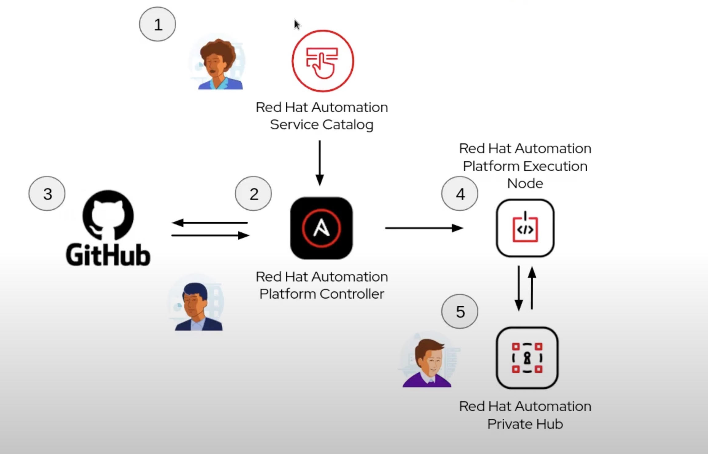

Red Hat Ansible Automation Platform
===================================

# Prérequis

## Accès SSH port 22 pour tous les VMS

## 3 VMs de Automation Controller

`RAM` 16Go

`CPUs` 4

`Filesystem /var/` 40Go


## 1 VM de Automation Sevices Catalog

`RAM` 16Go 

`CPUs` 4

`Filesystem /var/` 40Go

## 1 VM de Automation Hub

`RAM` 8Go 

`CPUs` 2

`Filesystem /var/lib/pulp` 60Go minimum

## 1 VM de base des données

`RAM` 16Go 

`CPUs` 4

`Filesystem /var/lib/pgsql` 60Go minimum

# Préparation de l'installation AAP

Téléchager [Ansible Automation Platform](https://access.redhat.com/downloads/content/480)

## Configuration les inventaires

Il faut spécifier les valuers confidentiel dans un fichier chiffré `@group_vars/env/secure` avec une variable préfixé `vault_`

```yaml
---
#les mot de passe de l'utilisateur "webadmin" sur chaque serveur
vault_become_pass_hostname1: valeur
vault_become_pass_hostname2: valeur
vault_become_pass_hostname3: valeur
vault_become_pass_hub_hostname: valeur
vault_become_pass_database_hostname: valeur

#le mot de passe de l'utilisateur admin de Automation Controller
vault_admin_password: valeur


vault_automationhub_admin_password: valeur

#le mot de passe de base des données de Automation Controller
vault_pg_password: valeur

vault_automationhub_pg_password: valeur

vault_automationcatalog_pg_password: valeur

vault_sso_keystore_password: valeur
```

```
$ ansible-vault encrypt group_vars/env/secure
```

`inventory/env`

```ini
[automationcontroller]
fqdn_controller_hostname_1 ansible_connection=local ansible_become_password='{{ vault_become_pass_hostname1 }}'
fqdn_controller_hostname_2 ansible_become_password='{{ vault_become_pass_hostname2 }}'
fqdn_controller_hostname_3 ansible_become_password='{{ vault_become_pass_hostname3 }}'

[automationhub]
fqdn_hub_hostname ansible_become_password='{{ vault_become_pass_hub_hostname }}'

[database]
fqdn_db_hostname ansible_become_password='{{ vault_become_pass_database_hostname }}'

[all:vars]
automation_platform_version='2.3'
minimum_ansible_version='2.14'

ansible_user=webadmin

admin_password='{{ vault_admin_password }}'

pg_host=fqdn_db_hostname
pg_port=5432

pg_database='awx'
pg_username='awx'
pg_password='{{ vault_pg_password }}'
pg_sslmode='prefer'

# Receptor Configuration
#
receptor_listener_port=27199

automationhub_admin_password='{{ vault_automationhub_admin_password }}'

automationhub_pg_host=fqdn_hub_hostname
automationhub_pg_port=5432

automationhub_pg_database='automationhub'
automationhub_pg_username='automationhub'
automationhub_pg_password='{{ vault_automationhub_pg_password }}'
automationhub_pg_sslmode='prefer'

# Chaine de l'autorité certificat de confiance
custom_ca_cert=/chemin/vers/ca.crt

# Certificate and key to install in nginx for the web UI and API
web_server_ssl_cert=/chemin/vers/tower.cert
web_server_ssl_key=/chemin/vers/tower.key

# Certificate and key to install in Automation Hub node
automationhub_ssl_cert=/chemin/vers/automationhub.cert
automationhub_ssl_key=/chemin/vers/automationhub.key

# Server-side SSL settings for PostgreSQL (when we are installing it).
postgres_use_ssl=True
postgres_ssl_cert=/chemin/vers/pgsql.crt
postgres_ssl_key=/chemin/vers/pgsql.key
```

`inventory/env_catalog`

```ini
[automationcatalog]
fqdn_catalog_hostname ansible_become_password='{{ vault_become_pass_catalog_hostname }}'

[database]
fqdn_db_hostname ansible_become_password='{{ vault_become_pass_database_hostname }}'

[sso]
nom_de_domain_sso ansible_become_pass='{{ vault_become_pass_catalog_hostname }}'

[all:vars]
automation_platform_version='2.3'

minimum_ansible_version='2.14'

ansible_user=webadmin

automationcatalog_pg_host=fqdn_db_hostname
automationcatalog_pg_port=5432

automationcatalog_pg_database='automationservicescatalog'
automationcatalog_pg_username='automationservicescatalog'
automationcatalog_pg_password='{{ vault_automationcatalog_pg_password }}'

automationcatalog_main_url=nom_de_domain_catalog

automation_controller_main_url=url_automation_controller

automationcatalog_controller_username='admin'
automationcatalog_controller_password='{{ vault_admin_password }}'

# Keystore file to install in SSO node certificat ssl et chaine de certificat autorité confiance
sso_custom_keystore_file='/chemin/vers/sso.jks'

sso_keystore_password='{{ vault_sso_keystore_password }}'
```

`ansible.cfg`

```ini
[privilege_escalation]
become=True
become_user=root
become_method=sudo
```

# Lancement de l'installation

## L'installation de Automation Controller et de Automation Hub

```
$ ./setup.sh -i inventory/env -e @group_var/env/secure -- --ask-vault-pass
```

## L'installation de Automation Catalog

```
$ ./setup.sh -i inventory/env_catalog -e @group_var/env/secure -- --ask-vault-pass
```

## Post installation de Automation Catalog

```
$ ansible-playbook -i inventory/env_catalog post_install_catalog.yml
```

- Install Guide -- https://access.redhat.com/documentation/en-us/red_hat_ansible_automation_platform/2.3/html-single/red_hat_ansible_automation_platform_installation_guide/index


