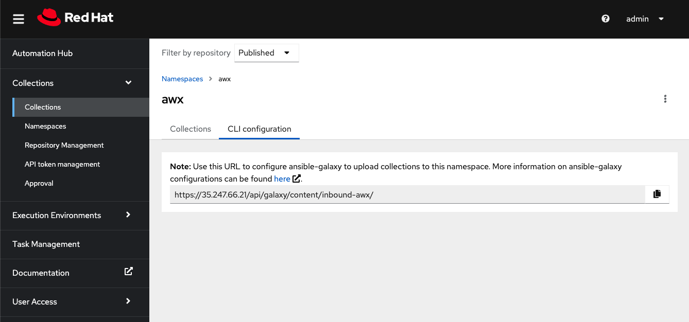

Ansible Collection
==================

# Prérequis

## ansible-galaxy


# Création de namespace dans Automation Hub Privé 

Dans le context de votre utilisation de la collection efficientip, le namespace ``community`` est requis.

Une astuce ici est après avoir créé l'espace de noms, cliquez sur la configuration CLI et copiez l'URL dans votre ansible.cfg, ainsi que le détail du jeton qui se trouve également sur la page.



# Configuration ansible.cfg
Dans le projet code source de votre collection il faut inclure le fichier `ansible.cfg`

```ini
[galaxy]

server_list = staging_repo

[galaxy_server.staging_repo]

url=https://35.247.66.21/api/galaxy/content/inbound-awx/

# Token de automation hub
token=1a38f6572ece08c6bf8ab9de8cdd1a122c3adf5a
```

# Publication de collection

```
efficientip_collection_dir#> ansible-galaxy collection build
efficientip_collection_dir#> ansible-galaxy collection publish path/to/my_namespace-my_collection-1.0.0.tar.gz
```